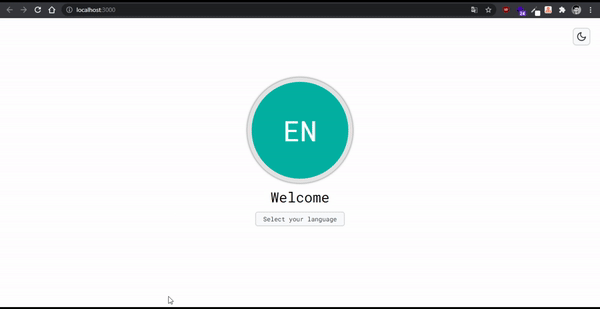

# 
 Localization Sample 

## ✨ Technologies

This project was developed with these technologies:

- [React](https://reactjs.org)
- [TypeScript](https://www.typescriptlang.org/)
- [SASS](https://sass-lang.com/)
- [react-intl](https://formatjs.io/docs/react-intl/)

## 💻 Project
This is a short project that aims to be a simple example reference for those who are planning to add localization to their apps.

## Useful React concepts in this project
 - Use of the context API to change language and theme
 - Use of custom hooks
 - Implemetation of a light/dark theme
 - Localization
 - Some responsiveness
 - Save settings in browser local storage
 - Use of typescript

## Folder structure
- src/components: Aplication components and its respective styles is scss syntax.
- src/contexts: Code of the context API used to change theme and language across the aplication.
- src/hooks: Hooks are an easy way to share functions across the aplication.
- src/localization: Files used to store the aplication texts in different languages (JSON).
- src/pages: Pages of the app.
- src/styles: Global scss styles.
- src/utils: Helper function used in the translations.